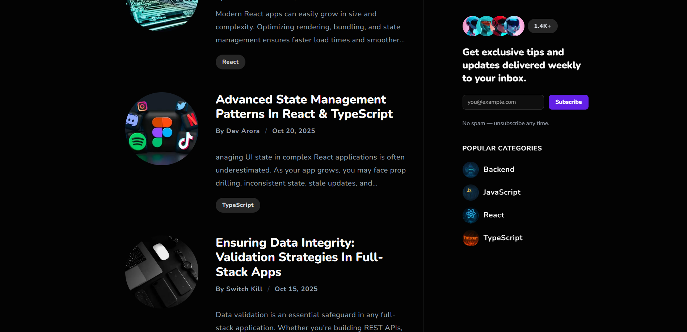
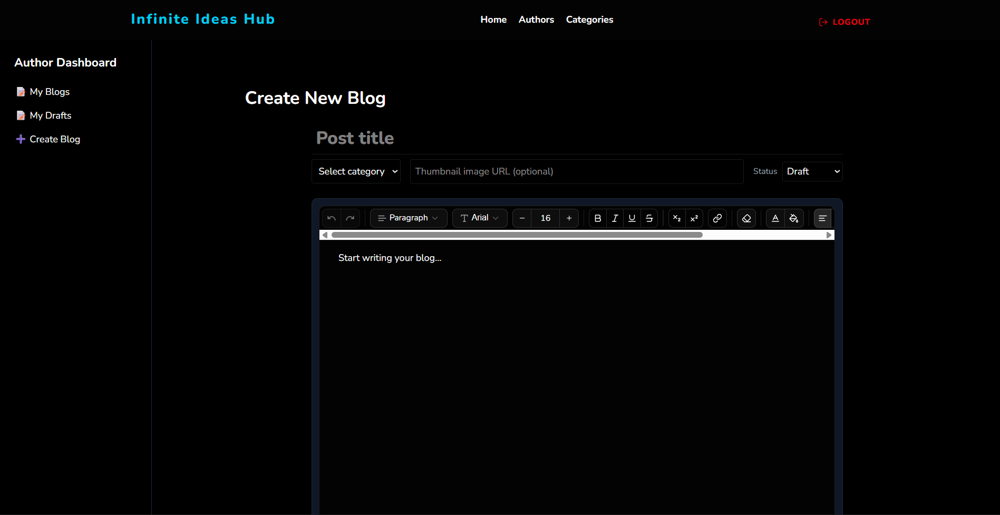
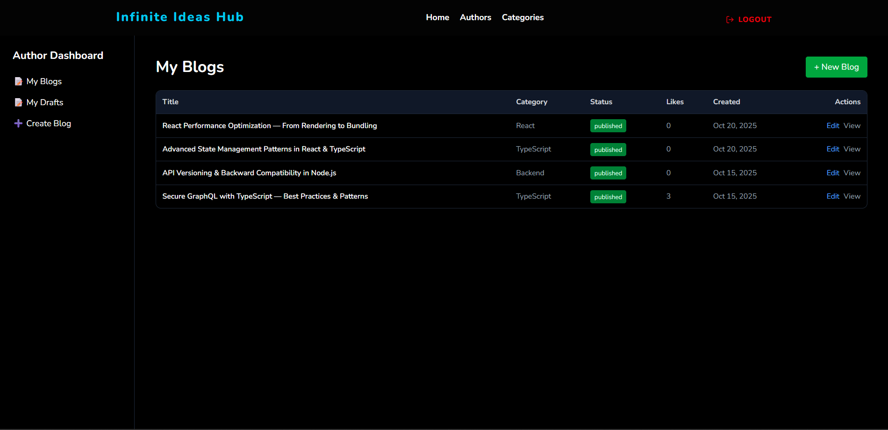
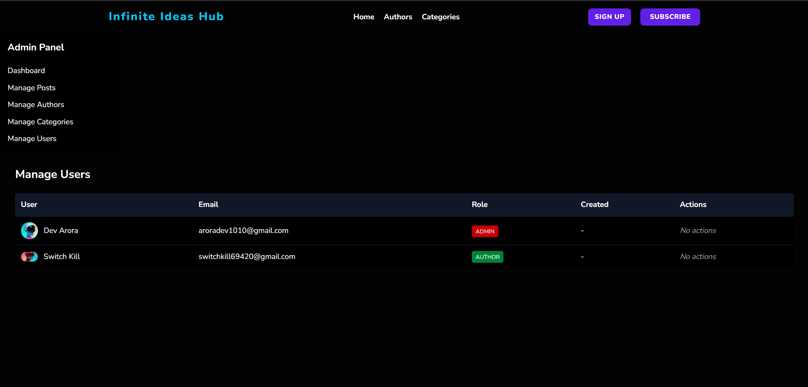
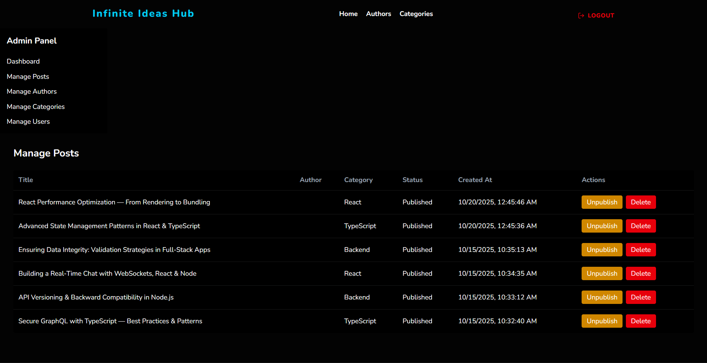

# Infinite Ideas Hub  
### AI-Powered Blogging Platform (Next.js App Router)

<div align="center">
  <br />
  <a href="https://your-deployed-url.com" target="_blank">
    
  </a>
  <br />

  <div>
    
    
    
    
    
  </div>

  <p align="center">
    A production-grade, AI-ready blogging platform featuring a custom rich-text editor,
    secure publishing workflows, and modern Next.js App Router architecture.
  </p>
</div>

---

## Table of Contents

- [Introduction](#introduction)
- [Why This Project Matters](#why-this-project-matters)
- [Key Features](#key-features)
- [Editor Design](#editor-design)
- [Security & Reliability](#security--reliability)
- [Tech Stack](#tech-stack)
- [Screenshots](#screenshots)
- [Local Setup](#local-setup)
- [Project Status & Roadmap](#project-status--roadmap)

---

## Introduction

**Infinite Ideas Hub** is a full-stack blogging platform built to explore **modern web architecture**,  
**secure content handling**, and **rich-text editor engineering** using the latest Next.js App Router.

Unlike traditional CMS demos, this project emphasizes:

- React Server Components (RSC)
- Correct App Router usage
- Editor state serialization & rehydration
- Server-side sanitization
- Strict TypeScript contracts
- Role-based authoring workflows

---

## Why This Project Matters

This is not a basic CRUD project.

It tackles real engineering challenges such as:

- Safe **Lexical JSON → HTML → Lexical JSON** transformations
- Preventing **XSS and insecure deserialization**
- Handling **Next.js 15 breaking changes**
- Managing editor drafts and rehydration
- Separating **database models from API/domain models**
- Ownership checks and role-based authorization

The project recently underwent a **critical React Server Components security upgrade**, requiring significant debugging, refactoring, and strict type alignment.

---

## Key Features

### Blogging
- Create, edit, publish, and draft blog posts
- Slug generation with collision handling
- Featured posts and category-based filtering
- Ownership enforcement for authors

### Authentication & Roles
- Secure authentication via NextAuth
- Author and Admin roles
- Admin override for moderation

### Dashboard
- Author dashboard for managing drafts and published posts
- Admin dashboard for managing authors and content

---

## Editor Design

The editor is built using **Lexical (EditorX)** and supports:

- Rich text formatting
- Tables, lists, embeds, and images
- Plugin-based extensibility
- Controlled serialization pipeline
- Reliable draft rehydration

### Editor Challenges Solved
- Correct list serialization (UL/OL/LI)
- Avoiding invalid span-wrapped list items
- Client/server boundary correctness
- Safe persistence of editor state

---

## Security & Reliability

### Security
- Server-side HTML sanitization
- Safe rendering of editor output
- Role-based access control
- Secure session handling via NextAuth
- Patched React Server Components RCE vulnerability

### Reliability
- Strict TypeScript enforcement
- DTO-based API contracts
- Defensive handling for evolving schemas
- Clear separation of concerns

---

## Tech Stack

### Frontend
- Next.js 15 (App Router)
- React Server Components
- Tailwind CSS
- ShadCN/UI
- Lexical (EditorX)

### Backend
- Next.js API Routes
- MongoDB Atlas
- NextAuth
- Server-side sanitization

### Tooling
- TypeScript (strict)
- ESLint
- GitHub
- Vercel

---


## Screenshots







---

## Local Setup

### Prerequisites

- **Node.js** ≥ 18  
- **MongoDB Atlas** account  
- **Git**

---

### Clone & Install

```bash
git clone https://github.com/aroradev1010/Infinite_Ideas_Hub_Next_JS.git
cd Infinite_Ideas_Hub_Next_JS
npm install

```

### Environment Variables

Create a `.env.local` file in the project root:

```env
MONGODB_URI=
MONGODB_DB=
NEXTAUTH_SECRET=
NEXTAUTH_URL=http://localhost:3000
RESEND_API_KEY=
RESEND_AUDIENCE_ID=
NEXT_PUBLIC_APP_URL=
GITHUB_CLIENT_ID=
GITHUB_CLIENT_SECRET=
GOOGLE_CLIENT_ID=
GOOGLE_CLIENT_SECRET=
NEXTAUTH_SECRET=

```
---

### Run Locally

```bash
npm run dev

```
---

## Project Status & Roadmap

### Completed

- Full blog CRUD (Create, Read, Update, Delete)
- Rich-text editor integration (Lexical / EditorX)
- Secure publishing pipeline with server-side sanitization
- Role-based access control (Author / Admin)
- Next.js 15 App Router migration
- React Server Components (RSC) security patch

---

### Planned

- AI-assisted writing features
- Autosave drafts
- Blog version history
- Editor preview API
- Analytics dashboard
